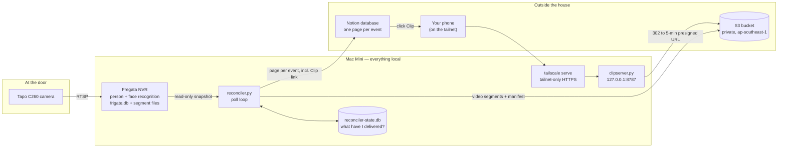

# Project Guide — camera-door-automation

How this project was started, what it became, and why every piece is the way it is.
Written for someone whose home turf is Salesforce — Apex, SOQL, Flow — and who wants
to be able to explain and defend every part of this system without hand-waving.

Companion documents:

- `LEARNING-NOTES.md` — the session-by-session record: wrong turns, verified facts,
  concept explainers, command reference.
- `CODE-REVIEW.md` — the structural review of `reconciler.py`, with every defect
  pinned by a test.
- `README.md` — the short operational readme.

---

## 1. What this system is

A camera watches the front door. **Fregata** (a native macOS build of the open-source
Frigate NVR) ingests its RTSP stream, detects people, runs face recognition, and
records everything it knows into a local SQLite database plus 10-second video segment
files on disk. **`reconciler.py`** runs on the same Mac Mini on a timer: each pass it
asks Fregata's database "what person events have finished?", asks its own state
database "which of those have I already delivered?", and closes the gap — uploading
the overlapping video segments to a private **S3** bucket and creating one page per
event in a **Notion** database, so the household has a browsable log of who came to
the door and when. Because the S3 bucket is private, a Notion page can't just link
straight to the video — so **`clipserver.py`** serves permanent
`/clip/<event_id>` links that redirect to freshly signed, five-minute S3 URLs, and
**Tailscale** fronts that server so only devices on the household's private network
(the "tailnet") can use the links at all. Everything that touches raw footage stays
in the house; only derived artifacts leave it.



Two design commitments explain nearly everything unusual in the code:

1. **It is a reconciler, not an event handler.** Nothing pushes events at this
   program. It wakes up, compares two ledgers, and converges. Kill it at any moment
   and the next pass picks up exactly where reality left off.
2. **Delivery state is a disposable cache, not a source of truth.** Deleting
   `reconciler-state.db` costs a re-upload, never data loss. Fregata's database is
   the truth about what happened; S3 and Notion are the durable outputs.

---

## 2. The build story, PR by PR

The wrong turns are documented deliberately — they are the most instructive part.
The full blow-by-blow is in `LEARNING-NOTES.md` §2; this is the arc.

### Before PR #1 — the Node.js version (commit `b7f0bd7`, "initialize repository")

The repo began as a completely different program: an event-driven **Node.js**
"entry logger" (`src/index.js`, `pipeline.js`, `sessions.js`, `sinks.js`, …) with a
Home Assistant automation file and architecture diagrams. It subscribed to events
and processed them as they happened — the "trigger" shape. Two loose commits then
added `event-driven/reconciler.py`, a 390-line Python rewrite of the idea as a
polling reconciler.

### PR #1 — "Shift to event-driven architecture with Python" (merged)

Written by Jules (Google's asynchronous coding agent) from a task the repo owner
started. It deleted the entire Node.js codebase, promoted `reconciler.py` to the
repo root, and rewrote the README. Despite the PR title, the architectural shift was
really the opposite of event-driven: from a push-based handler to a pull-based
reconciliation loop. This left a single ~390-line Python file as the whole system.

### Between PR #1 and #2 — the review and bring-up session

This is where the project actually became understood rather than merely generated:

- **A line-by-line code review found 14 issues** (`LEARNING-NOTES.md` §5). The two
  critical ones were configuration, not logic: `.gitignore` did not ignore `.env`
  (one credential file away from leaking AWS keys to a public repo), and
  `.env.example` still described the deleted JavaScript program — 19 of its 20
  variables were read by nothing.
- **Wrong turn #1 — the Docker assumption.** The first bring-up runbook was written
  around Frigate-in-Docker: container path translation, volume mounts. Correction:
  Fregata is a *native* macOS app. That inverted the risk analysis — with Docker, a
  wrong recordings path fails loudly (`FileNotFoundError`); native, the stored paths
  exist as-is, so a wrong `FREGATA_RECORDINGS_DIR` fails *silently* with mangled S3
  keys. The native case is more dangerous, not less.
- **Wrong turn #2 — "the data comes from the log file."** The owner pointed at
  Fregata's application log as the data source. Reading all 29,769 lines of it
  proved it couldn't be one: the face-recognition success lines carry no event ID,
  no camera, no times, no video path — you cannot join a name to a video with it.
  But the log was still the key that unlocked everything: buried paths revealed the
  data root (`/Users/swarm/Fregata/`), which meant the reconciler's hardcoded
  database defaults had been right all along. The log also showed the camera had
  been silently broken for a day (1,477 RTSP 404s on Aug 4) and then fixed.
  The durable lesson: logs are the program's diary; the database is the record of
  what happened. Integrate against the database.
- **Verification, then a clean dry run.** The real `frigate.db` was confirmed
  (camera `door_camera`, label `person`, names in `sub_label`), and a full dry run
  planned 312 events → 2,270 uploads → 1,891 distinct files → 21 GB, with zero
  mangled keys and zero errors.

### PR #2 — "Add Notion sink, fix .gitignore" (merged)

Added the second destination: one Notion page per delivered event (Event ID, Person,
Camera, Seen, Duration, Score, Segments, Manifest key), a rewritten `.env.example`
describing only variables the code actually reads, and the `.gitignore` fix.

The important design decision: a **separate `notion_delivery` table** instead of
reusing the S3 completion flag. With two destinations, "done" splits into two facts
that fail independently — one flag cannot express "S3 done, Notion not done", and a
Notion outage must never trigger a 21 GB S3 re-upload. Retries were limited to HTTP
429 (rate limit) only, because Notion page creation has no idempotency key: blindly
retrying a 5xx could create duplicate pages.

### PR #3 — "Worktree tests and review" (merged)

Brought the safety net: a **214-test suite at 99% line coverage** plus
`CODE-REVIEW.md`. The suite fakes S3 through the real botocore stack (`moto`) and
fakes Notion HTTP (`responses`) — no test can touch a real AWS account. Its signature
idea: every known-but-unfixed defect is encoded as a `strict=True` **xfail** test
asserting the *correct* behaviour. Fixing a defect flips its test to XPASS and turns
the suite red until the marker is removed — the defect list cannot silently rot.
The review also named the structural issues: `process_event` is a 69-line "god
function", and `Settings` is passed whole to functions that read two of its fields.

### PR #4 — "Harden the Notion sink before first live run" (merged)

Four defects that would all have fired the moment a real `NOTION_TOKEN` was set:

1. **Failure isolation.** A Notion failure re-raised into the S3 error handler and
   permanently marked all 312 already-uploaded events as FAILED. Notion failures now
   live and die in `notion_delivery`.
2. **API shape.** Notion's 2025-09-03 API split databases into "data sources".
   `notion_targets()` now resolves the right shape once and falls back, working on
   either side of the change.
3. **Privacy opt-in.** The first live run would have published nine housemates'
   real names to Notion. Person is now gated behind `NOTION_INCLUDE_PERSON`
   (default `false`); every page reads "Unrecognized" until deliberately enabled.
4. **Terminal state.** An attempts counter (`NOTION_MAX_ATTEMPTS`, default 5) stops
   a permanently broken event from being retried every 30 seconds forever — and the
   attempt is charged *before* the network call, so a crash mid-create cannot cause
   a duplicate page. A follow-up commit refined the blame rules: only a non-429 4xx
   (the event's own fault) charges an attempt; 429s, 5xxes and network errors refund
   it, so an outage cannot retire the whole backlog.

The same PR redacted the nine real first names from `LEARNING-NOTES.md` — this repo
is public. (They remain in git history; scrubbing that needs a history rewrite.)
A CSV template for bootstrapping the Notion database was added; its sample names
(Ada, Grace) are sanitized placeholders, not real people.

### The unmerged `notion-preflight` branch

`check_notion.py`: a read-only preflight that checks, in the order the failures
actually bite, that the token works, that the integration was actually *shared* with
the database (the manual UI step everyone forgets), which API shape the workspace is
on, and that every property exists with the exact name and type the code writes.
It creates nothing. Still an open branch, not merged. (A quick-and-dirty cousin,
`test-notion.py`, was committed straight to `main` — it dumps a property-by-property
ACTUAL vs WANTED table.)

### PR #5 — "Clip links in Notion via a tailnet-only redirect" (open, branch `clip-links`)

Until this PR, a Notion row carried only an S3 key as plain text — the bucket is
private, so a direct link would 403. Presigned S3 URLs can't be baked into pages
either: they expire in at most 7 days, and they're bearer tokens — anyone holding
one can watch the footage. The fix is indirection:

- `notion_properties()` writes a **Clip** URL property:
  `PUBLIC_BASE_URL/clip/<event_id>` — permanent, derived from the event ID alone.
- **`clipserver.py`** (new, ~180 lines) binds to 127.0.0.1 only, looks the event's
  segment keys up in the state DB (opened read-only), and answers `/clip/<id>` with
  a page of `<video>` players whose sources 302-redirect to five-minute presigned
  URLs minted at click time.
- **`tailscale serve`** fronts it, so the permanent link only resolves for devices
  on the tailnet. The tailnet *is* the access control.

The tests caught a real production-killer here: presigning was silently falling back
to the deprecated SigV2 signature format, and the bucket's region (`ap-southeast-1`)
does not support SigV2 at all — every clip link would have 403'd in production. The
S3 client is now pinned to SigV4.

Known limit stated in the PR: the ~312 pages already synced would never gain a Clip
link, because `sync_notion` short-circuits on `synced_at` and the program had no
page-update path.

### This branch — `notion-clip-backfill` (the Clip backfill)

Closes exactly that limit. `notion_delivery` gains two columns via the established
`ALTER TABLE` migration pattern in `open_state()`: `clip_synced_at` and
`clip_attempts`. A new `backfill_clip()` runs on the path where `sync_notion` used
to simply return ("page already exists"): if `PUBLIC_BASE_URL` is configured and the
page has no clip stamp yet, it **PATCHes** the existing Notion page with the Clip
URL — the program's first and only page-update path. It reuses the hardening
vocabulary wholesale: same attempts budget, same pre-charge-then-call ordering, same
blame/refund rules, never touches `synced_at`, never raises into the S3 path.
Newly created pages with a base URL configured are stamped immediately (the Clip
property was already in the create payload), so the PATCH only ever runs for the
genuine backlog. `status` reports `clip_synced` / `clip_pending` / `clip_gave_up`.

---

## 3. Salesforce translation table

Honest analogies only — each row says where the analogy breaks, because that is
where the learning is.

| This project | Closest Salesforce concept | Where the analogy breaks |
|---|---|---|
| The `watch` loop / a `once` pass | **Scheduled Batch Apex** whose `start()` re-queries `WHERE Status__c != 'Delivered'` — *not* a trigger | There is no platform scheduler or governor limits; the "scheduler" is launchd (macOS's cron-like supervisor) or a `while True: … sleep()` loop the code owns itself. If the process dies, nothing else runs it. |
| `reconciler-state.db` (`event_delivery`, `segment_delivery`, `notion_delivery`) | A **custom object per integration** tracking delivery state (`Integration_Delivery__c` with status, attempts, last error) | It is one local file with no org, no sharing model, no field history. And it is deliberately a *cache of completed work*: deleting it re-does work but loses nothing, which you would never say of org data. |
| `INSERT … ON CONFLICT(event_id) DO UPDATE` | **`Database.upsert(records, External_Id__c)`** | The "external ID" is declared per statement (the `ON CONFLICT` target), not on the field; `excluded` is a pseudo-row holding what would have been inserted. Same race-free semantics, though — no check-then-insert. |
| `.env` + `load_dotenv()` | **Named Credentials + Custom Settings/Custom Metadata** | It is a plain-text file; the *only* thing keeping secrets out of git is one `.gitignore` line (which was broken until PR #2). Every value arrives as a string — `DRY_RUN=false` is a *truthy* string unless explicitly parsed, a bug class Salesforce's typed metadata simply cannot have. |
| `?` placeholders in SQL | **SOQL bind variables** (`:accountId`) | Identical purpose — injection is structurally impossible for *values*. But neither system can bind an *identifier* (table/column name). For those, SQLite lets the code quote them (`qident()` wraps the name in `"…"` and doubles embedded quotes); SOQL identifiers can't be quoted or escaped at all, so the Apex equivalent is validating a dynamic field/object name against an allowlist or `Schema.getGlobalDescribe()` — **not** `String.escapeSingleQuotes()`, which only protects string *values* and gives zero protection to an injected identifier. |
| SQLite | *(no real analogue — this is the one to actually learn)* | No server, no port, no credentials, no daemon. The database is one ordinary file; `sqlite3.connect(path)` is best read as `open()`. Access control is file permissions; backup is `cp`; "the DB is down" can't happen but "another process holds the lock" can. Also unlike Apex, **nothing auto-commits** — forget `commit()` and your writes silently vanish when the connection closes. |
| boto3's credential chain | **Named Credential auth resolution** — your code says *what* to call, the platform works out *how to authenticate* | The chain has silent precedence: explicit params → `AWS_*` env vars → `~/.aws/` files → machine roles. A stale `~/.aws` profile can silently win over your `.env`, a failure mode Named Credentials' explicit binding doesn't have. |
| `NOTION_MAX_ATTEMPTS` + attempts counter + give-up state | **Platform Event trigger retries** (`EventBus.RetryableException`, capped at 9) | The platform primitive is *coarser*, not equivalent: there is no dead-letter queue, and when a subscriber exhausts its retries Salesforce suspends the **entire subscription** — every subsequent event stops flowing until someone resumes it. This project's per-event attempts row is exactly the finer-grained thing the platform doesn't give you: one bad event goes quiet *by itself*, and the blame rules (a non-429 4xx charges an attempt; 429/5xx/network errors are *refunded*) keep a Notion outage from retiring all 312. |
| At-least-once delivery + idempotent S3 keys | **Replayable Change Data Capture** — events can be re-delivered from the replay ID, so subscribers must be idempotent | The code *chooses* at-least-once (act, then record; a crash in the gap re-does the action). Safe for S3 because re-`PUT` of the same key with the same bytes is a no-op. **Not** naturally safe for Notion — page creation has no idempotency key — which is why the state row plus a dedupe query stand in for one. |
| `clipserver.py` + presigned URLs | Roughly **`ContentDistribution`** — minting a time-limited public URL for content in a private store | The expiry is 5 minutes, minted per click, and the *permanent* link in Notion is only reachable over the tailnet. There's no platform doing this for you: it's ~180 lines of deliberately boring Python standard-library HTTP server. |

Two non-analogies worth stating plainly, because they are the biggest mental shifts:

- **There is no platform.** Nothing schedules, retries, logs, secures, or supervises
  this code unless the code (or launchd, or Tailscale) does it explicitly. Every row
  in the table above is something Salesforce does *for* you that this project had to
  decide about *itself* — that is most of what the PR history is.
- **Python decorators are not Apex annotations.** `@dataclass(frozen=True)` is live
  code that runs at import time and rewrites the class; `@AuraEnabled` is an inert
  compile-time marker. See `LEARNING-NOTES.md` §4.

---

## 4. Reading the codebase today

### The files and their jobs

| File | Job |
|---|---|
| `reconciler.py` (~700 lines) | The whole pipeline: config (`Settings.from_env`), Fregata schema discovery, read-only DB snapshotting, the three-table state store, S3 upload, Notion sync + clip backfill, and the CLI (`inspect` / `once` / `watch` / `status`). One file, deliberately — the review (§1c of `CODE-REVIEW.md`) names the seams to cut when it stops being manageable. |
| `clipserver.py` | Loopback-only HTTP server. `/clip/<id>` renders one `<video>` per delivered segment; `/clip/<id>/<n>` and `/manifest/<id>` 302 to five-minute presigned S3 URLs; `/healthz` for supervision. Validates event IDs by regex, opens the state DB read-only, never logs query strings (signed URLs are credentials). |
| `check_notion.py` (unmerged `notion-preflight` branch) | Read-only Notion preflight: token, sharing, API shape, exact property names/types. |
| `test-notion.py` | Manual one-off: prints ACTUAL vs WANTED for each Notion property. |
| `tests/` (10 files) | 231 passing tests + 11 strict xfails (each xfail is a documented, still-open defect). Moto-faked S3, `responses`-faked Notion, no network. `tests/README.md` explains the machinery. |
| `launchd/*.plist` | macOS service definitions: `com.swarm.entry-logger` runs `reconciler.py watch`; `com.swarm.clipserver` keeps the clip server alive. |
| `.env.example` | Every variable the code reads, with the failure mode of getting each one wrong. The best-documented file in the repo; treat it as the config reference. |
| `notion-database-template.csv` | Import this to bootstrap the Notion database with correctly named/typed columns. Sample names are placeholders. |
| `CODE-REVIEW.md`, `LEARNING-NOTES.md`, `review-page.html` | The review, the history, and the published artifact copy of the review. |

### The three state tables and their lifecycle

All three live in `reconciler-state.db`, created and migrated by `open_state()`
(migration = `CREATE TABLE IF NOT EXISTS` for new installs, plus targeted
`ALTER TABLE ADD COLUMN` guarded by a column-existence check for old ones).

| Table | Key | One row means | Written when |
|---|---|---|---|
| `event_delivery` | `event_id` | "I have seen this event" | Row upserted at the start of processing (so failures have something to attach to); `completed_at` + `manifest_key` set only after every segment (and optionally the manifest) is uploaded; `last_error` on failure. `completed_at` is the guard that makes every later pass skip straight to the Notion check. |
| `segment_delivery` | `(event_id, source_path)` | "This file is in S3, with this key and ETag" | After each successful upload. On resume, an existing row's ETag is reused and the upload skipped — this is what makes a mid-event crash cost only the remaining files. |
| `notion_delivery` | `event_id` | "Notion knows about this event" | `attempts` charged *before* the create call; `page_id` + `synced_at` on success; `last_error` on failure; refunds for not-this-event's-fault errors. This branch adds `clip_synced_at` / `clip_attempts` with identical semantics for the Clip PATCH backfill. |

### What one poll pass does

```mermaid
sequenceDiagram
    participant W as watch loop / launchd
    participant R as run_once
    participant F as frigate.db (snapshot)
    participant ST as reconciler-state.db
    participant S3 as S3
    participant N as Notion

    W->>R: every POLL_SECONDS
    R->>F: snapshot the live DB (read-only backup)
    R->>F: resolve event/recordings tables (schema discovery)
    R->>F: SELECT finished person events on door_camera
    loop each event (oldest first)
        R->>ST: completed_at set?
        alt already delivered to S3
            R->>N: sync_notion — create page if missing,<br/>else backfill Clip link (PATCH)
        else not yet delivered
            R->>F: segments overlapping [start - pre_roll, end + post_roll]
            R->>ST: upsert event_delivery row
            loop each segment file
                R->>ST: already uploaded? reuse ETag
                R->>S3: upload_file + head_object
                R->>ST: record segment_delivery row, commit
            end
            R->>S3: manifest.json (only if enabled)
            R->>ST: set completed_at
            R->>N: sync_notion (create page)
        end
    end
    R->>R: delete the snapshot; sleep
```

Properties worth being able to defend out loud:

- **The snapshot** gives each pass one consistent view of Fregata's DB and makes
  writing to it structurally impossible (`mode=ro`).
- **The overlap test** `end_time >= ? AND start_time <= ?` is the standard interval
  intersection idiom — a 6-second event padded to a 31-second window matches
  exactly the 4 ten-second segments that cover it.
- **Ordering is the crash-safety.** Upload, *then* record; complete S3, *then*
  attempt Notion; charge the Notion attempt, *then* call. Each ordering was chosen
  against a specific failure and the comments in the code say which.
- **Failure isolation per sink.** An S3 problem writes `event_delivery.last_error`;
  a Notion problem stays inside `notion_delivery`; neither can undo or re-trigger
  the other.

---

## 5. Running it

Current condensed sequence (full command reference: `LEARNING-NOTES.md` §7).

**1. Setup.**

```bash
python3 -m venv venv && source venv/bin/activate
pip install -r requirements.txt          # boto3, requests, python-dotenv
cp .env.example .env                     # then edit — the file documents every key
```

`.env` starts with `DRY_RUN=true` and `UPLOAD_EVENT_MANIFEST=false`. Both defaults
are load-bearing; leave them until each later step says otherwise.

**2. Dry run.** Costs nothing, touches nothing external.

```bash
python3 reconciler.py inspect   # schema discovery only — safe anywhere
python3 reconciler.py once 2>&1 | tee dryrun.log
grep -c Traceback dryrun.log    # must be 0
grep -c 'external/' dryrun.log  # must be 0 — mangled-key detector
```

`external/` keys mean `FREGATA_RECORDINGS_DIR` is wrong — and on a native install
that misconfiguration is otherwise *silent*.

**3. S3 preflight.** Before pushing 21 GB, exercise all three S3 calls the program
makes (put, head, multipart) with two tiny objects — the script is in
`LEARNING-NOTES.md` §7. The killer misconfiguration it catches: a write-only IAM
policy, where every upload succeeds *and then throws* on `head_object`, re-uploading
(and re-billing) forever.

**4. Notion preflight.** Import `notion-database-template.csv` to create the
database (add a **Clip** column of type URL for clip links), share it with your
integration (the manual UI step: database page → ••• → Connections → Add
connection), then verify with `python3 test-notion.py` — or `check_notion.py` from
the `notion-preflight` branch for the thorough version. Every property name must
match exactly.

**5. Live.**

```bash
# .env: DRY_RUN=false, plus S3 + Notion credentials
python3 reconciler.py once      # the backfill — 21 GB, hours; pick your moment
python3 reconciler.py status
python3 reconciler.py once      # convergence test: finds same N, completes ~0
```

Then verify like an integrator: compare one object's `ContentLength` to the local
file size, download one clip and actually play it, open one Notion page and click
its Clip link from a tailnet device.

**6. Clip server.**

```bash
tailscale serve --bg 8787       # HTTPS certs must be enabled in the tailnet admin
# .env: PUBLIC_BASE_URL=https://<machine>.<tailnet>.ts.net
python3 clipserver.py
```

With `PUBLIC_BASE_URL` set, new pages get a Clip link at creation, and this
branch's backfill PATCHes it onto every already-synced page over subsequent passes.

**7. Autostart, last.** Copy both plists to `~/Library/LaunchAgents`, `sed` the
`YOURUSER` placeholders, and load with `launchctl bootstrap`. Nothing in launchd is
on the path to a first successful upload, so genuinely do this last — and remember
Fregata itself must also survive a reboot, or the reconciler polls a frozen
database and reports success forever.

**Tests** (development machine):

```bash
pip install -r requirements-dev.txt
pytest          # expect: 231 passed, 11 xfailed, ~20-30s
```

---

## 6. Where the project stands

**Merged:** PRs #1–#4. The pipeline is live-capable: S3 delivery proven by a clean
full dry run, and the Notion sink hardened specifically against everything that
would have gone wrong on first live contact.

**Open:** PR #5 (`clip-links`) — clipserver, the Clip column, the SigV4 pin.
**This branch** (`notion-clip-backfill`, cut from PR #5) removes PR #5's stated
limitation by backfilling the Clip link onto pre-existing pages via the program's
first page-update path.

**What the repo cannot tell you:** whether the live backfill has actually been run —
whether the 21 GB is in S3, whether the 312 Notion pages exist. The state database
and `.env` are (correctly) untracked, so the repo records capability, not
deployment. Run `reconciler.py status` on the Mac Mini for the truth.

### Open backlog

| Priority | Item | Detail |
|---|---|---|
| First | **Manifest `sub_label` privacy gap** | The manifest embeds the whole raw event row, real name included, and `NOTION_INCLUDE_PERSON` gates only Notion. Masked today solely by `UPLOAD_EVENT_MANIFEST=false`. Filter the fields, then re-enable manifests. The dry-run log leak of the same data (review defect #10) is the same fix. |
| High | **Watermark** | Every pass rescans all events from the beginning of time, plus one state query each, and snapshots the whole DB every 30 s (original findings #4 and #11). Fine at 312 events; not at 50k. |
| High | **S3-side retry cap** | `NOTION_MAX_ATTEMPTS` solved give-up for Notion only; a permanently broken *event* (deleted segment file) still retries every poll forever (review defect #7, still xfail). |
| Medium | **Log rotation** | Nothing rotates `err.log` under launchd. |
| Medium | **No CI** | 231 tests exist and nothing runs them automatically. A GitHub Actions `pytest` workflow is cheap insurance. |
| Medium | Supervision redesign | The entry-logger plist still pairs `KeepAlive` with an internal `watch` loop — two supervisors (original finding #13). |
| Low | Original findings #6, #9, #11, #12 | Dry-run state writes; `false_positive` events are archived; per-poll DB copy; ETag-as-checksum. |
| Low | Remaining review xfails | 11 defects stay encoded as strict xfails — startup validation, snapshot temp-file leak, Ctrl-C in sleep, path traversal, and friends. Each fix deletes its two marker lines. |
| Later | **Slack sink** | The per-sink delivery pattern now exists (`notion_delivery`), so a third sink is an additive change, not a redesign. |

### The habits this project should leave you with

`LEARNING-NOTES.md` closes with five; the three that matter most here:

1. **Run it and watch it fail** — the dry run taught more in 30 seconds than hours
   of reading.
2. **Trace one record end to end** — one 6-second event, through the overlap maths,
   to exactly 4 segments.
3. **Treat AI-written artifacts as claims to verify** — this repo's genuinely
   expert design decisions sat directly beside a `.gitignore` that would have
   leaked credentials, and nothing in the code's texture distinguished them.
