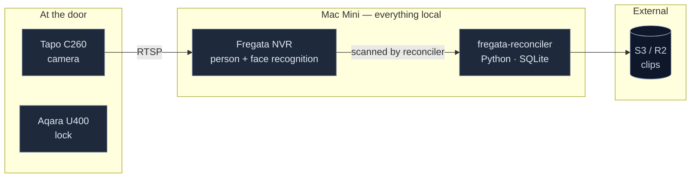

# fregata-reconciler

Event-driven ingestion service. Reconciles Fregata events and recording segments directly to S3.

## Architecture

Everything that touches footage runs on the Mac Mini. Only derived artifacts — clips and recording segments — leave the house.



## Setup

```bash
python3 -m venv venv
source venv/bin/activate
pip install -r requirements.txt
cp .env.example .env      # fill in credentials
```

Requires Python 3.12+.

### Autostart

```bash
cp launchd/com.swarm.entry-logger.plist ~/Library/LaunchAgents/
launchctl load ~/Library/LaunchAgents/com.swarm.entry-logger.plist
```

Edit the paths in the `.plist` file first. LaunchAgents need a logged-in session, so **enable auto-login on the Mac Mini** or nothing restarts after a power cut.

## Usage

The reconciler takes one of the following commands:

- `inspect`: Inspects the source Fregata database and outputs table/column information.
- `once`: Runs a single reconciliation pass over the Fregata database.
- `watch`: Runs `once` in an infinite loop, sleeping for `POLL_SECONDS` between passes.
- `status`: Outputs the current delivery status, including completed/failed events and uploaded segments.

Example:

```bash
python3 reconciler.py watch
```

## Dependency register

Everything the service needs, declared. Nothing here should live only in someone's shell history.

| Dependency | Where declared | Fails how |
|---|---|---|
| Fregata DB accessible | `FREGATA_DB_PATH` | Poll fails, cursor holds |
| S3 credentials | `.env` | Upload retries with backoff |
| Auto-login enabled | macOS setting | **Nothing restarts after power loss** |
