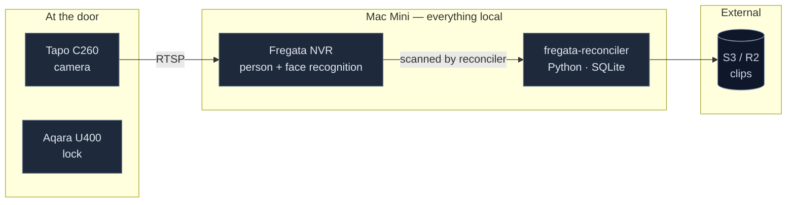

# fregata-reconciler

Event-driven ingestion service. Reconciles Fregata events and recording segments directly to S3.

## Architecture

Everything that touches footage runs on the Mac Mini. Only derived artifacts — clips and recording segments — leave the house.



## Setup

```bash
python3 -m venv venv
source venv/bin/activate
pip install -r requirements.txt
cp .env.example .env      # fill in credentials
```

Requires Python 3.12+.

### Autostart

```bash
cp launchd/com.swarm.entry-logger.plist ~/Library/LaunchAgents/
launchctl load ~/Library/LaunchAgents/com.swarm.entry-logger.plist
```

Edit the paths in the `.plist` file first. LaunchAgents need a logged-in session, so **enable auto-login on the Mac Mini** or nothing restarts after a power cut.

## Usage

The reconciler takes one of the following commands:

- `inspect`: Inspects the source Fregata database and outputs table/column information.
- `once`: Runs a single reconciliation pass over the Fregata database.
- `watch`: Runs `once` in an infinite loop, sleeping for `POLL_SECONDS` between passes.
- `status`: Outputs the current delivery status, including completed/failed events and uploaded segments.

Example:

```bash
python3 reconciler.py watch
```

## Clip links in Notion (optional)

With `CLIP_LINKS=true`, every Notion page gets a working video link in its **Clip**
property (create it in the database first, type **URL** — `python3 test-notion.py`
verifies it). The link opens a viewer page hosted in the S3 bucket, one player per
recording segment. No server runs anywhere: the reconciler presigns the page and its
videos, and the same poll loop that uploads footage re-signs any link older than
`CLIP_REFRESH_SECONDS` (signatures die at `CLIP_URL_TTL_SECONDS`; 7 days is the
SigV4 maximum). Pages synced before the feature existed pick their links up
automatically on the next pass.

Know what you are enabling:

- **The link is a bearer token.** Anyone who can see the Notion page — including via
  a share link or a forwarded URL — can watch that event until the signature expires.
  Keep the database's publish-to-web off. Notion's page history also retains
  superseded links until they expire on their own.
- **Re-signing does not revoke.** Old URLs stay valid to their own expiry. The kill
  switch is deactivating the signing key — set `CLIP_AWS_ACCESS_KEY_ID`/`_SECRET` to
  a dedicated read-only IAM user so that gesture doesn't stop uploads too.
- **Long-term IAM user keys only.** Session credentials (SSO/STS) silently cap the
  signature's life at the session's, and the reconciler can only warn about it.
- The signing identity needs `GetObject` on the prefix — already required for
  `head_object` — plus `PutObject` for the viewer page, which uploads have.
- If an S3 lifecycle rule expires old segments, the pages for those events keep
  rendering but their videos 404. The link makes existing retention visible.

After fixing a broken setup (Clip property was missing, or the signing key was
rotated), run `python3 reconciler.py clips-reset` to re-sign everything.

## Dependency register

Everything the service needs, declared. Nothing here should live only in someone's shell history.

| Dependency | Where declared | Fails how |
|---|---|---|
| Fregata DB accessible | `FREGATA_DB_PATH` | Poll fails, cursor holds |
| S3 credentials | `.env` | Upload retries with backoff |
| Auto-login enabled | macOS setting | **Nothing restarts after power loss** |
