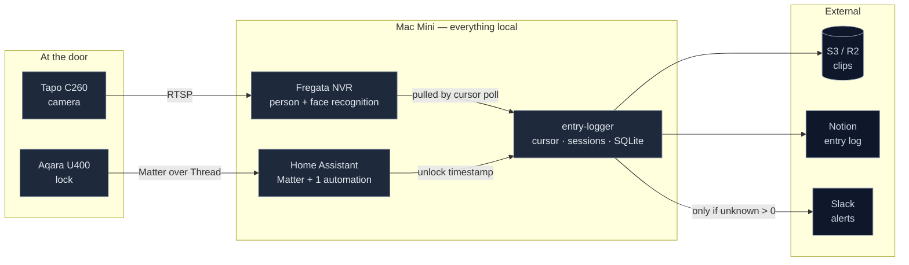
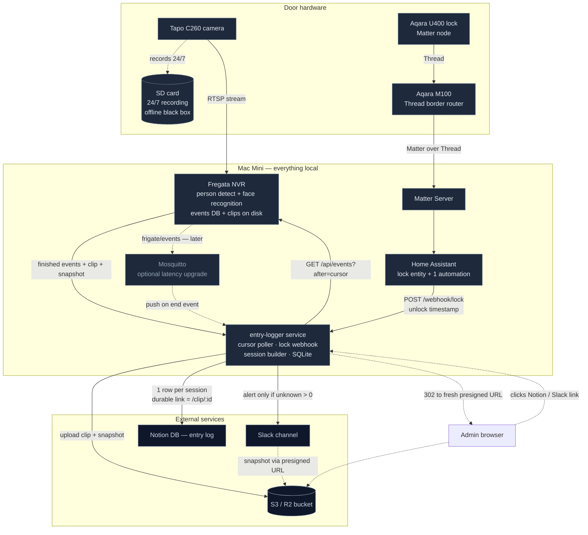

# entry-logger

Cursor-based ingestion service. Polls Frigate/Fregata for finished person events, groups them into entry sessions, uploads clips to object storage, writes one Notion row per session, and alerts Slack only when a session contains an unknown face.

## Architecture

Everything that touches footage runs on the Mac Mini. Only derived artifacts — clips, one row per session, and exception alerts — leave the house.



<details>
<summary><strong>Full topology</strong> — transports, the clip-link round trip, and the optional MQTT upgrade</summary>

Dashed edges are either passive (the SD card black box) or not built yet (Mosquitto).



</details>

Diagram sources are kept alongside the README as `architecture-hero.mermaid` and `architecture-detail.mermaid`; edit both together if the topology changes.

## Why a poller and not a webhook

Frigate/Fregata has no webhook. It offers MQTT push or HTTP pull. A cursor-based poller is the more resilient of the two: the read position is durable, so a crash mid-pass replays rather than skips, and an outage backfills in one pass on restart. MQTT is fire-and-forget — a message published while the consumer is down is gone with no record it existed.

The one real webhook in the system runs the other way: **Home Assistant → `POST /webhook/lock`**, because HA *can* call us.

## Setup

```bash
npm install
cp .env.example .env      # fill in credentials
mkdir -p data logs
npm start
```

Requires Node 20+.

### Notion database

Create a database with these properties. Names must match exactly — they appear only in `src/sinks.js`.

| Property | Type |
|---|---|
| `Name` | Title |
| `Date` | Date |
| `People entered` | Text |
| `Unknown` | Number |
| `Video recording` | URL |
| `Status` | Select — options: `Flagged`, `Cleared` |
| `Reviewed by` | Person (set by admins, not the service) |

Share the database with your integration, or writes 404.

### Slack

Bot token with `chat:write` (plus `chat:write.public` if the bot isn't in the channel). Omit `SLACK_BOT_TOKEN` to run logging-only.

### Home Assistant

See `ha-automation.yaml`. Generate the shared secret with `openssl rand -hex 32`.

### Autostart

```bash
cp launchd/com.swarm.entry-logger.plist ~/Library/LaunchAgents/
launchctl load ~/Library/LaunchAgents/com.swarm.entry-logger.plist
```

Edit the paths first. LaunchAgents need a logged-in session, so **enable auto-login on the Mac Mini** or nothing restarts after a power cut.

## How a session is built

1. An unlock opens a window: `[unlock, unlock + SESSION_WINDOW_SECONDS]`.
2. Person events starting inside that window attach to the session. Each one pushes the window out by `SESSION_EXTEND_SECONDS`, capped at `SESSION_MAX_SECONDS` — that's how tailgating lands in one session.
3. People are usually detected walking up *before* the lock fires, so unlock matching also looks back `PRE_UNLOCK_LOOKBACK_SECONDS`.
4. A person event with no matching window opens its own session, flagged no-unlock.
5. The session closes once the window has expired by `SESSION_CLOSE_GRACE_SECONDS` and every attached event has finalised.
6. Counts are computed from `sub_label`: a name means recognised, null means unknown.

### The four edge cases

| Case | How it's recorded |
|---|---|
| Normal entry | `entry`, with names and unknown count |
| Unlock, nobody on camera | `unlock_no_camera` |
| People, no unlock | `entry` with `has_unlock = 0` + a callout on the Notion page |
| Logger was offline | `gap` row spanning the window |

## Endpoints

| Route | Purpose |
|---|---|
| `POST /webhook/lock` | HA posts unlock timestamps. Auth: `X-Webhook-Token`. Idempotent on `id`. |
| `GET /clip/:eventId` | 302 to a freshly-minted presigned URL. Every view logged to `clip_views`. |
| `GET /healthz` | Heartbeat age, cursor position, pending publishes. 503 when stale. |

`/clip/:eventId` is why Notion links don't rot: the signature is minted at click time, not at write time. It also gives you an audit trail of who watched what.

## Exit tests

These are the acceptance gates from the pitch. A phase is done when its test passes, not when the code runs.

**P1 — ingestion.** Stop the service for an hour. Walk the door several times. Restart. Every event appears exactly once, and a gap row covers the window.

```bash
sqlite3 data/entry-logger.db "SELECT id, COUNT(*) FROM events GROUP BY id HAVING COUNT(*) > 1;"  # must be empty
```

**P2 — sinks.** Revoke the Notion token mid-run, let a few entries happen, restore it. Rows appear once. No duplicate Slack alerts — `slack_ts` is set before Notion is retried.

**P3 — correlation.** Two people through the door on one unlock. One session, `count_total > 1`.

**P4 — hardening.** Pull the power. The service returns unattended and writes a gap row.

## Known limitations

- **Unknowns are counted per event, not per person.** If tracking drops and re-acquires the same stranger, that reads as 2. The review queue lets an admin correct it; tune during soak before adding dedup logic.
- **Latency is bounded by `POLL_INTERVAL_MS`.** At 30s expect p95 ≈ 1–2 min. If you later need seconds, add Mosquitto and subscribe to `frigate/events` end-type messages — the poller stays as the backfill safety net and none of this code changes.
- **Only the first clip is linked** in the Notion row. Multi-event sessions have more; they're in `artifacts`.
- **`Tailscale-User-Login`** is assumed as the identity header. Verify against current Tailscale docs before relying on it for attribution.

## Dependency register

Everything the service needs, declared. Nothing here should live only in someone's shell history.

| Dependency | Where declared | Fails how |
|---|---|---|
| Frigate API reachable | `FRIGATE_URL` | Poll fails, retries, cursor holds |
| S3 credentials | `.env` | Upload retries with backoff |
| Notion token + DB share | `.env` | Session stays pending, retries |
| Slack token | `.env` | Alert retries; logging unaffected |
| Lock webhook secret | `.env` + HA `secrets.yaml` | Unlocks rejected 401; camera sessions still logged |
| Public base URL | `PUBLIC_BASE_URL` | Links point somewhere dead |
| Node runtime path | launchd plist | Service won't start |
| Auto-login enabled | macOS setting | **Nothing restarts after power loss** |
